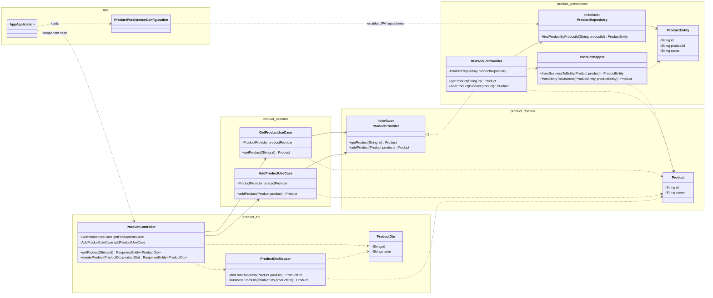

# Clean architect with Spring Boot 4.1 and Java 25

This is a small backend project with clean architect and Spring Boot 4.1, Java 25. It was inspired by Uncle Bob clean [architecture blog](https://blog.cleancoder.com/uncle-bob/2012/08/13/the-clean-architecture.html). It is a kind of typical micro-service project can exchange data REST APIs, store data to a DB.

# Components

## Domain

Entities encapsulate _Enterprise wide_ business rules. An entity can be an object with methods, or it can be a set of data structures and functions. It doesn’t matter so long as the entities could be used by many different applications in the enterprise. **In this project it is just pure java module with Java entities and Java interfaces.**

## Use case

The software in this layer contains _application specific_ business rules. It encapsulates and implements all of the use cases of the system. These use cases orchestrate the flow of data to and from the entities, and direct those entities to use their _enterprise wide_ business rules to achieve the goals of the use case. **In this project it is java project with actual classes are implementing the interfaces (rules) from *domain* **

## Persistent

The software in this layer is a set of adapters that convert data from the format most convenient for the use cases and entities, to the format most convenient for some external agency such as the Database or the Web. It is this layer, for example, that will wholly contain the MVC architecture of a GUI. The Presenters, Views, and Controllers all belong in here. The models are likely just data structures that are passed from the controllers to the use cases, and then back from the use cases to the presenters and views. **In this project it is implemented by Spring Data JPA**

## API

The software in this layer is a set of adapters that convert data from the format most convenient for the use cases and entities, to the format most convenient for some external agency such as the Database or the Web. It is this layer, for example, that will wholly contain the MVC architecture of a GUI. The Presenters, Views, and Controllers all belong in here. The models are likely just data structures that are passed from the controllers to the use cases, and then back from the use cases to the presenters and views. **In this project it is implement by Spring Web MVC**

## Main application

Spring boot application to link all of components by dependency injection technique. Other components like API, Persistent beans would be injected to main application as run time.

# Build and start application

## Build application
`./gradlew app:build` (Gradle 9.6.0)

## Start application
- Initial Mysql
  `docker-compose docker-compose/dockercompose.yaml -d`
- Start spring boot application
  `./gradlew app:bootRun`

## Testing

    curl --location 'http://localhost:8080/v1/product' \
    
    --header 'Content-Type: application/json' \
    
    --data  '{
    
    "id":12,
    
    "name": "dkkdd"
    
    }'
